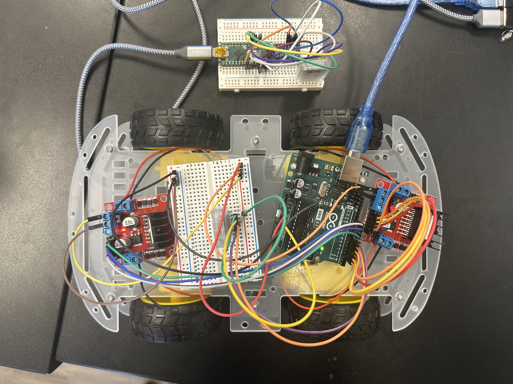

# Gesture Controlled Robot
The Gesture Controlled Robot is operated from a gauntlet device someone can wear on their wrist. By tilting or rotating the wrist, users can move the robot in all sorts of directions.

| **Engineer** | **School** | **Area of Interest** | **Grade** |
|:--:|:--:|:--:|:--:|
| Jerry G | Lynbrook High School | Mechanical Engineering | Incoming Sophomore

<!---**Replace the BlueStamp logo below with an image of yourself and your completed project. Follow the guide [here](https://tomcam.github.io/least-github-pages/adding-images-github-pages-site.html) if you need help.** -->


  
# Final Milestone

<!--- **Don't forget to replace the text below with the embedding for your milestone video. Go to Youtube, click Share -> Embed, and copy and paste the code to replace what's below.** -->

<!--- <iframe width="560" height="315" src="https://www.youtube.com/embed/F7M7imOVGug" title="YouTube video player" frameborder="0" allow="accelerometer; autoplay; clipboard-write; encrypted-media; gyroscope; picture-in-picture; web-share" allowfullscreen></iframe> -->

<!--- For your final milestone, explain the outcome of your project. Key details to include are:
- What you've accomplished since your previous milestone
- What your biggest challenges and triumphs were at BSE
- A summary of key topics you learned about
- What you hope to learn in the future after everything you've learned at BSE -->


# Second Milestone

<!--- **Don't forget to replace the text below with the embedding for your milestone video. Go to Youtube, click Share -> Embed, and copy and paste the code to replace what's below.** -->

<iframe width="560" height="315" src="https://www.youtube.com/embed/n-TfUV6b3V0?si=D2EkX0eaJVq6PVdI" title="YouTube video player" frameborder="0" allow="accelerometer; autoplay; clipboard-write; encrypted-media; gyroscope; picture-in-picture; web-share" referrerpolicy="strict-origin-when-cross-origin" allowfullscreen></iframe>
My second milestone was mostly about bluetooth. First off, I had to connect and pair the two HC05's. I searched up many tutorials about how to do this. The process included going into AT Mode, changing the settings of the Master & Slave HC05's, etc. One main challenge that I encountered was trying to figure out how to use a voltage divider. Because my arduino nano runs on 5V and the HC05 uses 3.3V, I had to use a voltage divider to make sure the HC05 doesn't get damaged. I spent at least half a day trying to figure this out, until I realized that I had an accelerometer to use (because of this I didn't use a voltage divider). I was able to get the accelerometer to print out data in the form of acceleration in the x, y, and z directions, as well as the acceleration of the rotation in the x, y, z directions. The final part of this milestone was to send the data from the accelerometer to the arduino uno. This was arguably the hardest part of the milestone and it definitely took a lot of time, but I was able to accomplish this in the end. 
For my final milestone, my goal is to put everything together. Most of it will be writing code to turn the accelerometer data into actual movements of the robot. 

Figure : Overhead Picture of Completed Milestone 2 



### Code for Nano - Transmits Accelerometer Data
```
#include <SoftwareSerial.h>
#include <Adafruit_MPU6050.h>
#include <Adafruit_Sensor.h>
#include <Wire.h>

SoftwareSerial BT_Serial(2, 3); //TX, RX pins on nano

Adafruit_MPU6050 mpu;

void setup(void) {
  BT_Serial.begin(9600); //sets baud rate
  Serial.begin(9600); //sets baud rate
  mpu.begin(); 

  mpu.setAccelerometerRange(MPU6050_RANGE_8_G); //setup
  mpu.setGyroRange(MPU6050_RANGE_500_DEG);
  mpu.setFilterBandwidth(MPU6050_BAND_21_HZ);

  delay(100); 
}

void loop() {
  sensors_event_t a, g, temp; 
  mpu.getEvent(&a, &g, &temp); //get data
  BT_Serial.print(a.acceleration.x); //print data in one line
  BT_Serial.print(",");
  BT_Serial.print(a.acceleration.y); 
  BT_Serial.print(",");
  BT_Serial.print(a.acceleration.z); 
  BT_Serial.print(",");
  BT_Serial.print(g.gyro.x);         
  BT_Serial.print(",");
  BT_Serial.print(g.gyro.y);         
  BT_Serial.print(",");
  BT_Serial.println(g.gyro.z);  
  Serial.print(a.acceleration.x); 
  Serial.print(",");
  Serial.print(a.acceleration.y); 
  Serial.print(",");
  Serial.print(a.acceleration.z); 
  Serial.print(",");
  Serial.print(g.gyro.x);         
  Serial.print(",");
  Serial.print(g.gyro.y);         
  Serial.print(",");
  Serial.println(g.gyro.z);  

  delay(500); //update every 0.5 seconds
}
```
### Code for Uno - Receives Accelerometer Data
```
#include <SoftwareSerial.h>

SoftwareSerial mySerial(6, 7); //TX, RX pins on Uno

void setup() {
  Serial.begin(9600); //sets baud rate
  mySerial.begin(9600); //sets baud rate
}

void loop() {
  if (mySerial.available()) { //if data is available to be read
    String msg = mySerial.readStringUntil('\n'); //set a variable as the line of data
    Serial.println(msg); //print data in serial monitor
  }
}
```
# First Milestone

<!--- **Don't forget to replace the text below with the embedding for your milestone video. Go to Youtube, click Share -> Embed, and copy and paste the code to replace what's below.** -->

<iframe width="560" height="315" src="https://www.youtube.com/embed/7Dbkg9NT-sA?si=TJ2dOaJaLXVbonkF" title="YouTube video player" frameborder="0" allow="accelerometer; autoplay; clipboard-write; encrypted-media; gyroscope; picture-in-picture; web-share" referrerpolicy="strict-origin-when-cross-origin" allowfullscreen></iframe> 

My first milestone was essentially building the hardware section of the robot. I assembled the car and attached all the motors. I soldered wires onto the motors and made sure the motors were locked into place on the chassis. Important materials that I used during milestone 1 included 2 L298 motor drivers, an Arduino Uno R3, a breadboard, 4 DC motors, and the chassis. I wired everything and connected all the pins with the help of a breadboard. The motor drivers received commands such as HIGH or LOW, HIGH meant the motor should spin, LOW meant it shouldn't. After writing some simple code just to make sure the motors would spin, I uploaded the code to the Arduino Uno, which is responsible for processing commands. Now, all I needed to do was to power it all up using a 9V battery that was connected to a barrel jack wire. I ran the code, and all 4 motors were able to work. So far, everything has gone smoothly. I had some problems understanding how to assemble the chassis and I had to de-assemble the top because I forgot to solder wires onto the motors, but all I had to do was unscrew the top. My biggest concern right now is the organization. The motor drivers, breadboard, and arduino are all currently just sitting on top of the actual robot, so there are a lot of wires just floating around which is really confusing. All the components aren't set yet, but I plan on zip tying everything down once I make sure that's where I want everything. Next, I plan on moving to milestone 2, which is starting the bluetooth section. This includes creating the actual gaunlet someone will be wearing, using the bluetooth modules, and wiring everything together. 

Figure : Overhead Picture of Completed Milestone 1


### Code for motors

```
int motor1pin1 = 2; 
int motor1pin2 = 3;

int motor2pin1 = 4;
int motor2pin2 = 5;

int motor3pin1 = 8;
int motor3pin2 = 9;

int motor4pin1 = 10;
int motor4pin2 = 11;

void setup() {
 pinMode(motor1pin1, OUTPUT);
 pinMode(motor1pin2, OUTPUT);
 pinMode(motor2pin1, OUTPUT);
 pinMode(motor2pin2, OUTPUT);
 pinMode(motor3pin1, OUTPUT);
 pinMode(motor3pin2, OUTPUT);
 pinMode(motor4pin1, OUTPUT);
 pinMode(motor4pin2, OUTPUT);

//code for all motors to spin in the same direction

 digitalWrite(motor1pin1, LOW);
 digitalWrite(motor1pin2, HIGH);
 digitalWrite(motor2pin1, LOW);
 digitalWrite(motor2pin2, HIGH);
 digitalWrite(motor3pin1, LOW);
 digitalWrite(motor3pin2, HIGH);
 digitalWrite(motor4pin1, LOW);
 digitalWrite(motor4pin2, HIGH);

 delay(5000); //spin for 5 seconds

 digitalWrite(motor1pin1, LOW);
 digitalWrite(motor1pin2, LOW);
 digitalWrite(motor2pin1, LOW);
 digitalWrite(motor2pin2, LOW);
 digitalWrite(motor3pin1, LOW);
 digitalWrite(motor3pin2, LOW);
 digitalWrite(motor4pin1, LOW);
 digitalWrite(motor4pin2, LOW); //code to stop motors
}
```

<!--- For your first milestone, describe what your project is and how you plan to build it. You can include:
- An explanation about the different components of your project and how they will all integrate together
- Technical progress you've made so far
- Challenges you're facing and solving in your future milestones
- What your plan is to complete your project -->

# Schematics 
<!--- Here's where you'll put images of your schematics. [Tinkercad](https://www.tinkercad.com/blog/official-guide-to-tinkercad-circuits) and [Fritzing](https://fritzing.org/learning/) are both great resoruces to create professional schematic diagrams, though BSE recommends Tinkercad becuase it can be done easily and for free in the browser. -->
Figure :Schematic of Milestone 1


# Code
<!--- Here's where you'll put your code. The syntax below places it into a block of code. Follow the guide [here]([url](https://www.markdownguide.org/extended-syntax/)) to learn how to customize it to your project needs. -->
<!---
```c++
void setup() {
  // put your setup code here, to run once:
  Serial.begin(9600);
  Serial.println("Hello World!");
}

void loop() {
  // put your main code here, to run repeatedly:

}
```
-->
# Bill of Materials
<!--- Here's where you'll list the parts in your project. To add more rows, just copy and paste the example rows below.
Don't forget to place the link of where to buy each component inside the quotation marks in the corresponding row after href =. Follow the guide [here]([url](https://www.markdownguide.org/extended-syntax/)) to learn how to customize this to your project needs. -->

| **Part** | **Note** | **Price** | **Link** |
|:--:|:--:|:--:|:--:|
| Arduino Uno R3 | Acts as core receiver and processor  | $27.60 | <a href="https://www.amazon.com/Arduino-A000066-ARDUINO-UNO-R3/dp/B008GRTSV6/"> Link </a> |
| Arduino Nano | Collects sensor data and transmits sensor data via bluetooth | $24.99 | <a href="https://www.amazon.com/Arduino-A000005-ARDUINO-Nano/dp/B0097AU5OU"> Link </a> |
| Breadboard 2x | Provides temporary platform for connections without having to solder | $5.99 each | <a href="https://www.mouser.com/ProductDetail/Digilent/240-131?qs=gTYE2QTfZfS7/w4FOFzSRg%3D%3D&mgh=1&srsltid=AfmBOoq_DqzNH3QCVTBkvXPghZvhxHymVPTR62cZiMzNSXeOhdsl_N4zPZI&gQT=1"> Link </a> | 
| L298N Motor Driver 2x | Controls direction and speed of motors by directions from arduino uno | $6.98 for both | <a href="https://www.amazon.com/WWZMDiB-L298N-H-Bridge-Controller-Raspberry/dp/B0CR6BX5QL/ref=sr_1_2_sspa?dib=eyJ2IjoiMSJ9.hK2FjV8Ukp8CCyVTI1seMskWTzUR3u8M18DspBKGCZgYDeP4KmmNh9jV8Sw_8jmddnqW7n7S60ZD4sITbPuNnmhG6_Jmi2g8H4LT3Ou1Uv7e0Af-0GtPNTTjrqbm9XwxjfgJ3KipsPypQiMOJc3B_x6YxUFnU-9sTBqXaUoBOITVtbYAZrkUy1eK7cd40kIIauBTSsTUTCNp9iY4Yrgx4zWuCYaLVZU0hKOH82eZRXu1LNX1cA22ElnH8BlNcXZbUOjxjrzqc4TSToiZ8oy2p0DYvIVUah47O4bzUaHl88A.TvYbvOl_qwPwp4axQ9bhhtDbaF-C6EBrjWbGAHjMDbg&dib_tag=se&hvadid=693917981683&hvdev=c&hvexpln=67&hvlocphy=9032171&hvnetw=g&hvocijid=3911697270286251565--&hvqmt=e&hvrand=3911697270286251565&hvtargid=kwd-876396251405&hydadcr=27055_14522414&keywords=l298n%2Bmotor%2Bdriver%2Bamazon&mcid=66999136bb7b31d19f4e31dfc83d7773&qid=1751386348&sr=8-2-spons&sp_csd=d2lkZ2V0TmFtZT1zcF9hdGY&th=1"> Link </a> | 
| HC05 Bluetooth Module 2x | Enables wireless communication between arduino uno and nano | $9.99 for each | <a href="https://www.amazon.com/DSD-TECH-HC-05-Pass-through-Communication/dp/B01G9KSAF6"> Link </a> | 
| MPU-6050 | Measures acceleration and rotational acceleration data | $6.99 | <a href="https://www.amazon.com/Gy-521-MPU-6050-MPU6050-Sensors-Accelerometer/dp/B008BOPN40/ref=sr_1_5?dib=eyJ2IjoiMSJ9.nQ-HfKOFyZoszrV3cxLK6szL_dfkU7ZnseUB1MbsDUCzFR-8wBkn34b7NCZO_4orLJm6FULqPDrZNHNMPsn1Gy6htp8eB_kVwxRQE54A_hXDQbSrqeAxXhUts1L6vaNzFA5RgBYDguODHG5rz57YTz-fG_2awN-GcNxkSKUtLbMMWVTjoevLo2cn0ilpa63o0r31PK9PxBkvPstC-dAtZNwjC-HMH-8ra8P0ISbjcVo.24lwM7T3WsrX9fQn4lxEBwaWvPXfeecylyOCcyYQFOA&dib_tag=se&keywords=MPU-6050&qid=1751386495&sr=8-5"> Link </a> | 
| Jumper Wires 120x | Used for simple and easy to disconnect connections | $6.98 for 120 wires | <a href="https://www.amazon.com/Elegoo-EL-CP-004-Multicolored-Breadboard-arduino/dp/B01EV70C78/ref=sr_1_1_sspa?dib=eyJ2IjoiMSJ9.I3nSspk5onl8Jong0G-0Eej0s1agLXJoNbNWfIFXRRDCBX2qnnOlChaMRC0kBgb9UB0IT5X1ZBDteHYg6iR6rao50jH78e49Zc85ulJNfiDtOWkK9xnpwEzeilqQous0xLrh-Fxi2CI5fXiycQvwNnwcJ4f2tTlSJ-siyvTi2m592GjPXgLKpT0AghwWWsQtveA6QdAMOPeCbUs9WaGogYNjYg9rhN4GdH8-e9vmnZs.PPRIPHBZ9FRCxj-WkiO81zar1ddFCMiL1aR8MHpZLRk&dib_tag=se&keywords=jumper+wires&qid=1751386571&sr=8-1-spons&sp_csd=d2lkZ2V0TmFtZT1zcF9hdGY&psc=1"> Link </a> | 
| DC Motors 4x + Rubber Wheels 4x | Necessities for drivetrain to work | $9.99 for everything | <a href="https://www.amazon.com/Gebildet-DC3V-12V-Four-Wheel-Robotic-Aircraft/dp/B08D39MFN1/ref=sr_1_36?dib=eyJ2IjoiMSJ9.JsoJZc2DggitzGoVSvLgme3vWL-e7C642jdBswYSZP6WpbUD2k6m6qqU3qc9Rcmoh_PxOLbqpw7_ro-28rsw_-RJnf8NkEBJJtazqj1b88Kpkq3aFrW_UxR5oILOKAgGSJZ66HSHFwVDs1GJXfpmtWrjXK3qAcwLvTr7d0E44bCAmBNluPLSuDUl5oBdZoZcRo0SHNNrJFXemZbn2UMfW2c-evelgkzYc6jS433o_t2LFUuhqEzBQsRK-X2LFuJecdPywNArpEFZdPPLixGB_XZFq6P5qn71I2HBH1j7FjI.G-gtEIcjgIzpSFGGQ06oT0bQAxxUTX_wY-7qZ38gkXk&dib_tag=se&keywords=dc%2Bmotor&qid=1751386760&sr=8-36&th=1"> Link </a> | 
| 9V Battery | Power source | $12.06 for 8 (1.50 for one) | <a href="https://www.amazon.com/Amazon-Basics-Performance-All-Purpose-Batteries/dp/B00MH4QM1S/ref=asc_df_B00MH4QM1S?mcid=82e8b879c5b13903b3394a75e722f279&hvocijid=18143419046042856148-B00MH4QM1S-&hvexpln=73&tag=hyprod-20&linkCode=df0&hvadid=721245378154&hvpos=&hvnetw=g&hvrand=18143419046042856148&hvpone=&hvptwo=&hvqmt=&hvdev=c&hvdvcmdl=&hvlocint=&hvlocphy=9032171&hvtargid=pla-2281435180738&th=1"> Link </a> | 

<!--- # Other Resources/Examples
One of the best parts about Github is that you can view how other people set up their own work. Here are some past BSE portfolios that are awesome examples. You can view how they set up their portfolio, and you can view their index.md files to understand how they implemented different portfolio components.
- [Example 1](https://trashytuber.github.io/YimingJiaBlueStamp/)
- [Example 2](https://sviatil0.github.io/Sviatoslav_BSE/)
- [Example 3](https://arneshkumar.github.io/arneshbluestamp/)

To watch the BSE tutorial on how to create a portfolio, click here. -->

# Starter Project - 6/17/25

<iframe width="560" height="315" src="https://www.youtube.com/embed/2kwSJgJjW6E?si=UGgxnVTeYXJCwrKC" title="YouTube video player" frameborder="0" allow="accelerometer; autoplay; clipboard-write; encrypted-media; gyroscope; picture-in-picture; web-share" referrerpolicy="strict-origin-when-cross-origin" allowfullscreen></iframe>

### Summary
For the starter project, I chose the RGB Slider. The RGB Slider features three sliders, one that corresponds for the Red, Green, and Blue values of an LED light. It is powered through a USB-C port. Finally, there's the LED light that ultimately displays the colors. This project also allows for colors to mix (when the red and blue sliders are slid to the maximum, purple light is shown). 
### Challenges
Although this project was straightforward, I encountered challenges while working on this project. The first challenge I met was after I had soldered on all the components. I plugged the power in and played around with the sliders, but the LED light wouldn't turn on. I asked my instructor and it turns out that I had soldered the LED light on the wrong way. So I had to de-solder the LED light using a desoldering pump. After this was finished, I tested with the power on again. The red and blue sliders worked perfectly, but the green slider didn't work at all. My instructor thought that the plastic board had been faulty, so I restarted from scratch. After doing the entire process again, all three sliders finally worked, resulting in an exciting RGB Slider starter project. 
### Next Steps
Next, I will be starting my intensive project, which is the Gesture Controlled Robot. 
