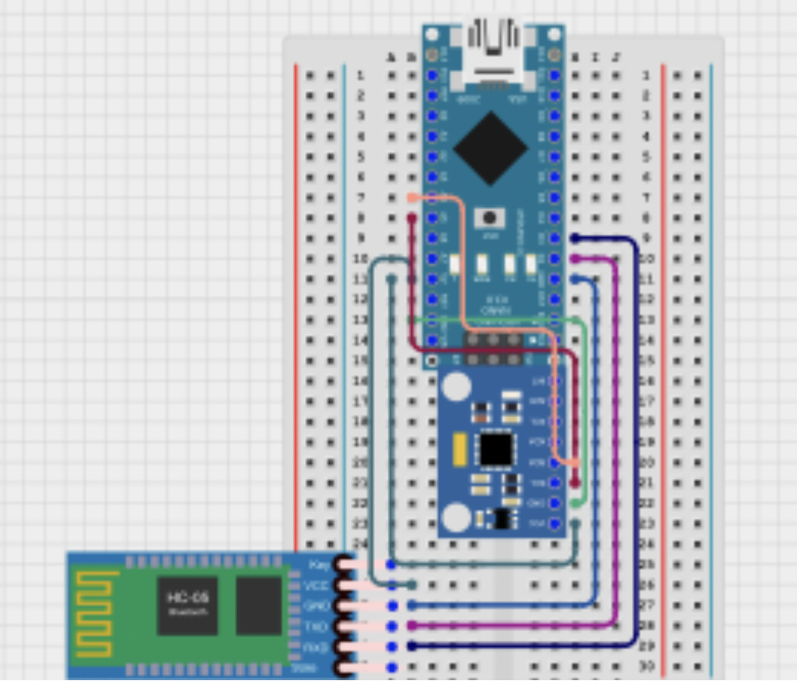

# Gesture Controlled Robot
The Gesture Controlled Robot is operated from a gauntlet device someone can wear on their wrist. By tilting or rotating the wrist, users can move the robot in all sorts of directions.

| **Engineer** | **School** | **Area of Interest** | **Grade** |
|:--:|:--:|:--:|:--:|
| Jerry G | Lynbrook High School | Mechanical Engineering | Incoming Sophomore

<!---**Replace the BlueStamp logo below with an image of yourself and your completed project. Follow the guide [here](https://tomcam.github.io/least-github-pages/adding-images-github-pages-site.html) if you need help.** -->


  
# Final Milestone

<!--- **Don't forget to replace the text below with the embedding for your milestone video. Go to Youtube, click Share -> Embed, and copy and paste the code to replace what's below.** -->

<!--- <iframe width="560" height="315" src="https://www.youtube.com/embed/F7M7imOVGug" title="YouTube video player" frameborder="0" allow="accelerometer; autoplay; clipboard-write; encrypted-media; gyroscope; picture-in-picture; web-share" allowfullscreen></iframe> -->

<!--- For your final milestone, explain the outcome of your project. Key details to include are:
- What you've accomplished since your previous milestone
- What your biggest challenges and triumphs were at BSE
- A summary of key topics you learned about
- What you hope to learn in the future after everything you've learned at BSE -->


# Second Milestone

<!--- **Don't forget to replace the text below with the embedding for your milestone video. Go to Youtube, click Share -> Embed, and copy and paste the code to replace what's below.** -->

<iframe width="560" height="315" src="https://www.youtube.com/embed/n-TfUV6b3V0?si=D2EkX0eaJVq6PVdI" title="YouTube video player" frameborder="0" allow="accelerometer; autoplay; clipboard-write; encrypted-media; gyroscope; picture-in-picture; web-share" referrerpolicy="strict-origin-when-cross-origin" allowfullscreen></iframe>

### Summary
My second milestone focused mainly on the Bluetooth communication aspect of the project. The first step was to connect and pair two HC-05 Bluetooth modules. These modules enable wireless communication between the Bluetooth gauntlet and the robotic car by transmitting data over a short range. To accomplish this, I followed several online tutorials that guided me through entering AT Mode and changing the settings to configure one HC-05 as the Master and the other as the Slave. The MPU6050 accelerometer is a sensor that measures acceleration forces in three directions (x, y, and z axes), as well as rotational acceleration, which provides information about the motion and orientation of the glove. Using the accelerometer, I successfully obtained data outputs showing movement in all three axes. After this, the next step was to send the raw data from the Arduino Nano to the Arduino Uno via the bluetooth modules, which I was also able to accomplish. 
### Challenges
One significant challenge I faced was figuring out how to use a voltage divider to protect the HC-05 modules, since the Arduino Nano operates at 5V logic while the HC-05 requires 3.3V signals. I spent several hours trying to set up the voltage divider correctly, but eventually realized I could use an accelerometer without needing the voltage divider. The most tedious part of this milestone was sending the accelerometer data wirelessly from the Arduino Nano to the Arduino Uno. I had to write a lot of code and debug it everytime it failed. 
### Next Steps
For my final milestone, my goal is to turn the raw data from the accelerometer into commands for the car to move. 


Figure : Overhead Picture of Completed Milestone 2 

### Code for Nano - Transmits Accelerometer Data
```
#include <SoftwareSerial.h>
#include <Adafruit_MPU6050.h>
#include <Adafruit_Sensor.h>
#include <Wire.h>

SoftwareSerial BT_Serial(2, 3); //TX, RX pins on nano

Adafruit_MPU6050 mpu;

void setup(void) {
  BT_Serial.begin(9600); //sets baud rate
  Serial.begin(9600); //sets baud rate
  mpu.begin(); 

  mpu.setAccelerometerRange(MPU6050_RANGE_8_G); //setup
  mpu.setGyroRange(MPU6050_RANGE_500_DEG);
  mpu.setFilterBandwidth(MPU6050_BAND_21_HZ);

  delay(100); 
}

void loop() {
  sensors_event_t a, g, temp; 
  mpu.getEvent(&a, &g, &temp); //get data
  BT_Serial.print(a.acceleration.x); //print data in one line
  BT_Serial.print(",");
  BT_Serial.print(a.acceleration.y); 
  BT_Serial.print(",");
  BT_Serial.print(a.acceleration.z); 
  BT_Serial.print(",");
  BT_Serial.print(g.gyro.x);         
  BT_Serial.print(",");
  BT_Serial.print(g.gyro.y);         
  BT_Serial.print(",");
  BT_Serial.println(g.gyro.z);  
  Serial.print(a.acceleration.x); 
  Serial.print(",");
  Serial.print(a.acceleration.y); 
  Serial.print(",");
  Serial.print(a.acceleration.z); 
  Serial.print(",");
  Serial.print(g.gyro.x);         
  Serial.print(",");
  Serial.print(g.gyro.y);         
  Serial.print(",");
  Serial.println(g.gyro.z);  

  delay(500); //update every 0.5 seconds
}
```
### Code for Uno - Receives Accelerometer Data
```
#include <SoftwareSerial.h>

SoftwareSerial mySerial(6, 7); //TX, RX pins on Uno

void setup() {
  Serial.begin(9600); //sets baud rate
  mySerial.begin(9600); //sets baud rate
}

void loop() {
  if (mySerial.available()) { //if data is available to be read
    String msg = mySerial.readStringUntil('\n'); //set a variable as the line of data
    Serial.println(msg); //print data in serial monitor
  }
}
```
# First Milestone

<!--- **Don't forget to replace the text below with the embedding for your milestone video. Go to Youtube, click Share -> Embed, and copy and paste the code to replace what's below.** -->

<iframe width="560" height="315" src="https://www.youtube.com/embed/7Dbkg9NT-sA?si=TJ2dOaJaLXVbonkF" title="YouTube video player" frameborder="0" allow="accelerometer; autoplay; clipboard-write; encrypted-media; gyroscope; picture-in-picture; web-share" referrerpolicy="strict-origin-when-cross-origin" allowfullscreen></iframe> 

### Summary
For my first milestone, I focused on building the hardware section of the robot. I assembled the chassis and attached all four DC motors, soldering wires onto each motor to ensure a secure connection. The motors were firmly locked into place on the chassis to prevent any movement during operation. The key components I used included four DC motors, two L298 motor driver modules, an Arduino Uno R3, a breadboard, and the chassis itself. The motor drivers act as controllers between the Arduino and the motors, receiving commands such as HIGH or LOW to control whether the motors spin or stop. The Arduino serves as the main controller, processing these commands and sending signals to the motor drivers. I wired everything together using a breadboard to connect the pins and components without having to solder. After writing and uploading simple test code to the Arduino, I powered the system with a 9V battery connected using a barrel jack wire, and all four motors successfully spun as expected. 
### Challenges
While the assembly mostly went smoothly, I faced some challenges. At first, I forgot to solder wires to the motors before attaching the top of the chassis, which required me to unscrew and disassemble part of the robot to fix it. I do have some concerns as of now. The motor drivers, breadboard, and Arduino are loosely placed on top of the chassis, with many wires hanging loosely, making the setup messy. I plan to tidy up the wiring with zip ties once I confirm the final component layout. 
### Next Steps
Next, I plan to move on to milestone two, which involves building the Bluetooth gauntlet that will be worn to control the robot wirelessly. This will include integrating Bluetooth modules and wiring the glove for communication with the robot.


Figure : Overhead Picture of Completed Milestone 1

### Code for motors

```
int motor1pin1 = 2; 
int motor1pin2 = 3;

int motor2pin1 = 4;
int motor2pin2 = 5;

int motor3pin1 = 8;
int motor3pin2 = 9;

int motor4pin1 = 10;
int motor4pin2 = 11;

void setup() {
 pinMode(motor1pin1, OUTPUT);
 pinMode(motor1pin2, OUTPUT);
 pinMode(motor2pin1, OUTPUT);
 pinMode(motor2pin2, OUTPUT);
 pinMode(motor3pin1, OUTPUT);
 pinMode(motor3pin2, OUTPUT);
 pinMode(motor4pin1, OUTPUT);
 pinMode(motor4pin2, OUTPUT);

//code for all motors to spin in the same direction

 digitalWrite(motor1pin1, LOW);
 digitalWrite(motor1pin2, HIGH);
 digitalWrite(motor2pin1, LOW);
 digitalWrite(motor2pin2, HIGH);
 digitalWrite(motor3pin1, LOW);
 digitalWrite(motor3pin2, HIGH);
 digitalWrite(motor4pin1, LOW);
 digitalWrite(motor4pin2, HIGH);

 delay(5000); //spin for 5 seconds

 digitalWrite(motor1pin1, LOW);
 digitalWrite(motor1pin2, LOW);
 digitalWrite(motor2pin1, LOW);
 digitalWrite(motor2pin2, LOW);
 digitalWrite(motor3pin1, LOW);
 digitalWrite(motor3pin2, LOW);
 digitalWrite(motor4pin1, LOW);
 digitalWrite(motor4pin2, LOW); //code to stop motors
}
```

<!--- For your first milestone, describe what your project is and how you plan to build it. You can include:
- An explanation about the different components of your project and how they will all integrate together
- Technical progress you've made so far
- Challenges you're facing and solving in your future milestones
- What your plan is to complete your project -->

# Schematics 
<!--- Here's where you'll put images of your schematics. [Tinkercad](https://www.tinkercad.com/blog/official-guide-to-tinkercad-circuits) and [Fritzing](https://fritzing.org/learning/) are both great resoruces to create professional schematic diagrams, though BSE recommends Tinkercad becuase it can be done easily and for free in the browser. -->


Figure :Schematic of Milestone 1




Figure :Schematic of Bluetooth Gauntlet after Milestone 2


Figure :Schematic of Bluetooth Gauntlet after Milestone 2


# Code
<!--- Here's where you'll put your code. The syntax below places it into a block of code. Follow the guide [here]([url](https://www.markdownguide.org/extended-syntax/)) to learn how to customize it to your project needs. -->
<!---
```c++
void setup() {
  // put your setup code here, to run once:
  Serial.begin(9600);
  Serial.println("Hello World!");
}

void loop() {
  // put your main code here, to run repeatedly:

}
```
-->
# Bill of Materials
<!--- Here's where you'll list the parts in your project. To add more rows, just copy and paste the example rows below.
Don't forget to place the link of where to buy each component inside the quotation marks in the corresponding row after href =. Follow the guide [here]([url](https://www.markdownguide.org/extended-syntax/)) to learn how to customize this to your project needs. -->

| **Part** | **Note** | **Price** | **Link** |
|:--:|:--:|:--:|:--:|
| Arduino Uno R3 | Acts as core receiver and processor  | $27.60 | <a href="https://www.amazon.com/Arduino-A000066-ARDUINO-UNO-R3/dp/B008GRTSV6/"> Link </a> |
| Arduino Nano | Collects sensor data and transmits sensor data via bluetooth | $24.99 | <a href="https://www.amazon.com/Arduino-A000005-ARDUINO-Nano/dp/B0097AU5OU"> Link </a> |
| Breadboard 2x | Provides temporary platform for connections without having to solder | $5.99 each | <a href="https://www.mouser.com/ProductDetail/Digilent/240-131?qs=gTYE2QTfZfS7/w4FOFzSRg%3D%3D&mgh=1&srsltid=AfmBOoq_DqzNH3QCVTBkvXPghZvhxHymVPTR62cZiMzNSXeOhdsl_N4zPZI&gQT=1"> Link </a> | 
| L298N Motor Driver 2x | Controls direction and speed of motors by directions from arduino uno | $6.98 for both | <a href="https://www.amazon.com/WWZMDiB-L298N-H-Bridge-Controller-Raspberry/dp/B0CR6BX5QL/ref=sr_1_2_sspa?dib=eyJ2IjoiMSJ9.hK2FjV8Ukp8CCyVTI1seMskWTzUR3u8M18DspBKGCZgYDeP4KmmNh9jV8Sw_8jmddnqW7n7S60ZD4sITbPuNnmhG6_Jmi2g8H4LT3Ou1Uv7e0Af-0GtPNTTjrqbm9XwxjfgJ3KipsPypQiMOJc3B_x6YxUFnU-9sTBqXaUoBOITVtbYAZrkUy1eK7cd40kIIauBTSsTUTCNp9iY4Yrgx4zWuCYaLVZU0hKOH82eZRXu1LNX1cA22ElnH8BlNcXZbUOjxjrzqc4TSToiZ8oy2p0DYvIVUah47O4bzUaHl88A.TvYbvOl_qwPwp4axQ9bhhtDbaF-C6EBrjWbGAHjMDbg&dib_tag=se&hvadid=693917981683&hvdev=c&hvexpln=67&hvlocphy=9032171&hvnetw=g&hvocijid=3911697270286251565--&hvqmt=e&hvrand=3911697270286251565&hvtargid=kwd-876396251405&hydadcr=27055_14522414&keywords=l298n%2Bmotor%2Bdriver%2Bamazon&mcid=66999136bb7b31d19f4e31dfc83d7773&qid=1751386348&sr=8-2-spons&sp_csd=d2lkZ2V0TmFtZT1zcF9hdGY&th=1"> Link </a> | 
| HC05 Bluetooth Module 2x | Enables wireless communication between arduino uno and nano | $9.99 for each | <a href="https://www.amazon.com/DSD-TECH-HC-05-Pass-through-Communication/dp/B01G9KSAF6"> Link </a> | 
| MPU-6050 | Measures acceleration and rotational acceleration data | $6.99 | <a href="https://www.amazon.com/Gy-521-MPU-6050-MPU6050-Sensors-Accelerometer/dp/B008BOPN40/ref=sr_1_5?dib=eyJ2IjoiMSJ9.nQ-HfKOFyZoszrV3cxLK6szL_dfkU7ZnseUB1MbsDUCzFR-8wBkn34b7NCZO_4orLJm6FULqPDrZNHNMPsn1Gy6htp8eB_kVwxRQE54A_hXDQbSrqeAxXhUts1L6vaNzFA5RgBYDguODHG5rz57YTz-fG_2awN-GcNxkSKUtLbMMWVTjoevLo2cn0ilpa63o0r31PK9PxBkvPstC-dAtZNwjC-HMH-8ra8P0ISbjcVo.24lwM7T3WsrX9fQn4lxEBwaWvPXfeecylyOCcyYQFOA&dib_tag=se&keywords=MPU-6050&qid=1751386495&sr=8-5"> Link </a> | 
| Jumper Wires 120x | Used for simple and easy to disconnect connections | $6.98 for 120 wires | <a href="https://www.amazon.com/Elegoo-EL-CP-004-Multicolored-Breadboard-arduino/dp/B01EV70C78/ref=sr_1_1_sspa?dib=eyJ2IjoiMSJ9.I3nSspk5onl8Jong0G-0Eej0s1agLXJoNbNWfIFXRRDCBX2qnnOlChaMRC0kBgb9UB0IT5X1ZBDteHYg6iR6rao50jH78e49Zc85ulJNfiDtOWkK9xnpwEzeilqQous0xLrh-Fxi2CI5fXiycQvwNnwcJ4f2tTlSJ-siyvTi2m592GjPXgLKpT0AghwWWsQtveA6QdAMOPeCbUs9WaGogYNjYg9rhN4GdH8-e9vmnZs.PPRIPHBZ9FRCxj-WkiO81zar1ddFCMiL1aR8MHpZLRk&dib_tag=se&keywords=jumper+wires&qid=1751386571&sr=8-1-spons&sp_csd=d2lkZ2V0TmFtZT1zcF9hdGY&psc=1"> Link </a> | 
| DC Motors 4x + Rubber Wheels 4x | Necessities for drivetrain to work | $9.99 for everything | <a href="https://www.amazon.com/Gebildet-DC3V-12V-Four-Wheel-Robotic-Aircraft/dp/B08D39MFN1/ref=sr_1_36?dib=eyJ2IjoiMSJ9.JsoJZc2DggitzGoVSvLgme3vWL-e7C642jdBswYSZP6WpbUD2k6m6qqU3qc9Rcmoh_PxOLbqpw7_ro-28rsw_-RJnf8NkEBJJtazqj1b88Kpkq3aFrW_UxR5oILOKAgGSJZ66HSHFwVDs1GJXfpmtWrjXK3qAcwLvTr7d0E44bCAmBNluPLSuDUl5oBdZoZcRo0SHNNrJFXemZbn2UMfW2c-evelgkzYc6jS433o_t2LFUuhqEzBQsRK-X2LFuJecdPywNArpEFZdPPLixGB_XZFq6P5qn71I2HBH1j7FjI.G-gtEIcjgIzpSFGGQ06oT0bQAxxUTX_wY-7qZ38gkXk&dib_tag=se&keywords=dc%2Bmotor&qid=1751386760&sr=8-36&th=1"> Link </a> | 
| 9V Battery | Power source | $12.06 for 8 (1.50 for one) | <a href="https://www.amazon.com/Amazon-Basics-Performance-All-Purpose-Batteries/dp/B00MH4QM1S/ref=asc_df_B00MH4QM1S?mcid=82e8b879c5b13903b3394a75e722f279&hvocijid=18143419046042856148-B00MH4QM1S-&hvexpln=73&tag=hyprod-20&linkCode=df0&hvadid=721245378154&hvpos=&hvnetw=g&hvrand=18143419046042856148&hvpone=&hvptwo=&hvqmt=&hvdev=c&hvdvcmdl=&hvlocint=&hvlocphy=9032171&hvtargid=pla-2281435180738&th=1"> Link </a> | 

<!--- # Other Resources/Examples
One of the best parts about Github is that you can view how other people set up their own work. Here are some past BSE portfolios that are awesome examples. You can view how they set up their portfolio, and you can view their index.md files to understand how they implemented different portfolio components.
- [Example 1](https://trashytuber.github.io/YimingJiaBlueStamp/)
- [Example 2](https://sviatil0.github.io/Sviatoslav_BSE/)
- [Example 3](https://arneshkumar.github.io/arneshbluestamp/)

To watch the BSE tutorial on how to create a portfolio, click here. -->

# Starter Project - 6/17/25

<iframe width="560" height="315" src="https://www.youtube.com/embed/2kwSJgJjW6E?si=UGgxnVTeYXJCwrKC" title="YouTube video player" frameborder="0" allow="accelerometer; autoplay; clipboard-write; encrypted-media; gyroscope; picture-in-picture; web-share" referrerpolicy="strict-origin-when-cross-origin" allowfullscreen></iframe>

### Summary
For the starter project, I chose the RGB Slider. The RGB Slider features three sliders, one that corresponds for the Red, Green, and Blue values of an LED light. It is powered through a USB-C port. Finally, there's the LED light that ultimately displays the colors. This project also allows for colors to mix (when the red and blue sliders are slid to the maximum, purple light is shown). 
### Challenges
Although this project was straightforward, I encountered challenges while working on this project. The first challenge I met was after I had soldered on all the components. I plugged the power in and played around with the sliders, but the LED light wouldn't turn on. I asked my instructor and it turns out that I had soldered the LED light on the wrong way. So I had to de-solder the LED light using a desoldering pump. After this was finished, I tested with the power on again. The red and blue sliders worked perfectly, but the green slider didn't work at all. My instructor thought that the plastic board had been faulty, so I restarted from scratch. After doing the entire process again, all three sliders finally worked, resulting in an exciting RGB Slider starter project. 
### Next Steps
Next, I will be starting my intensive project, which is the Gesture Controlled Robot. 
